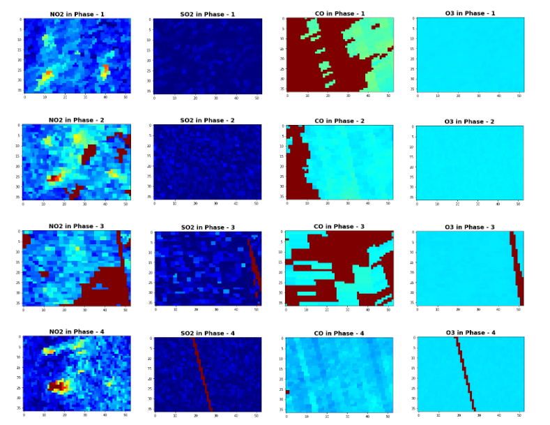
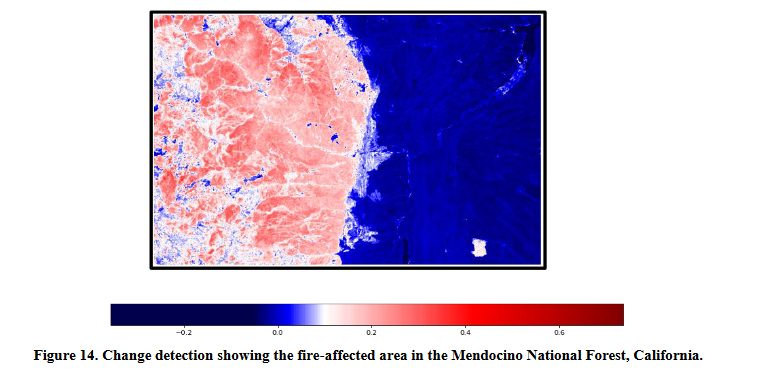
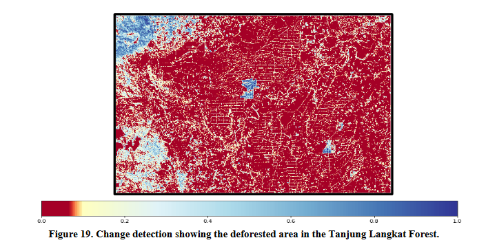
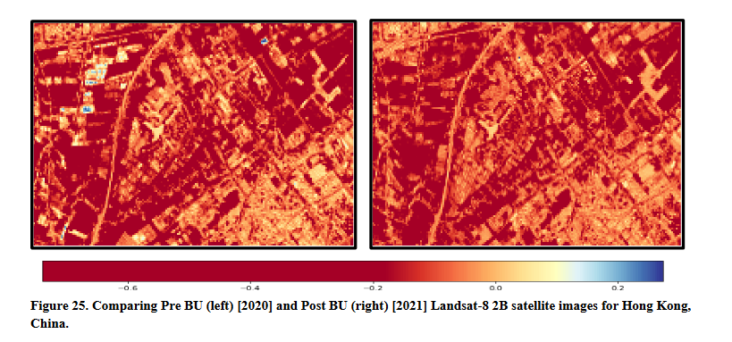

# Environmental Changes caused by COVID-19 and the Associated Societal Responses: A Review 

This  study  entailed  a  review  of  environmental  changes  caused  by  COVID-19  and  the  associated 
societal responses. The topic itself describes the effect of COVID-19 on Air quality, Deforestation, Wildfires 
& urbanization. It includes the use case of both statistical data and satellite data for getting the impact of 
the  COVID-19  pandemic.

Here are the files for describing this study :
- [Python Notebooks ](https://github.com/deepalim100/-Environmental-Changes-caused-by-COVID-19-and-the-Associated-Societal-Responses/tree/main/Notebook) : Visualization notebooks of the impacts of environmental changes.
- [Python Script files](https://github.com/deepalim100/-Environmental-Changes-caused-by-COVID-19-and-the-Associated-Societal-Responses/tree/main/Python_scripts):For running the process on local machine.
- [EDA report](https://github.com/deepalim100/-Environmental-Changes-caused-by-COVID-19-and-the-Associated-Societal-Responses/blob/main/Environmental_changes_caused_by_COVID-19_and_the_associated_societal_responses.pdf): Documented PDF report for explaining the analysis of geospatial data and statistical data.
- [Summary report](https://github.com/deepalim100/-Environmental-Changes-caused-by-COVID-19-and-the-Associated-Societal-Responses/blob/main/Summary_Report.pdf): Document for answering all the required questions.

# Analysis of geospatial data
### 1. Change in Air quality:
- [Notebook](https://github.com/deepalim100/-Environmental-Changes-caused-by-COVID-19-and-the-Associated-Societal-Responses/blob/main/Notebook/Air_pollution.ipynb)
- [python script](https://github.com/deepalim100/-Environmental-Changes-caused-by-COVID-19-and-the-Associated-Societal-Responses/blob/main/Python_scripts/Air_pollution.py)

### 2. Wildfire events:
- [Notebook](https://github.com/deepalim100/-Environmental-Changes-caused-by-COVID-19-and-the-Associated-Societal-Responses/blob/main/Notebook/Wildfire_events.ipynb)
- [python script](https://github.com/deepalim100/-Environmental-Changes-caused-by-COVID-19-and-the-Associated-Societal-Responses/blob/main/Python_scripts/Wildfire.py)

### 3. Deforestation:
- [Notebook](https://github.com/deepalim100/-Environmental-Changes-caused-by-COVID-19-and-the-Associated-Societal-Responses/blob/main/Notebook/Deforestation.ipynb)
- [python script](https://github.com/deepalim100/-Environmental-Changes-caused-by-COVID-19-and-the-Associated-Societal-Responses/blob/main/Python_scripts/Deforestation.py)

### 4. Urban growth:
- [Notebook](https://github.com/deepalim100/-Environmental-Changes-caused-by-COVID-19-and-the-Associated-Societal-Responses/blob/main/Notebook/urban_growth.ipynb)
- [python script](https://github.com/deepalim100/-Environmental-Changes-caused-by-COVID-19-and-the-Associated-Societal-Responses/blob/main/Python_scripts/Urban_growth.py)

